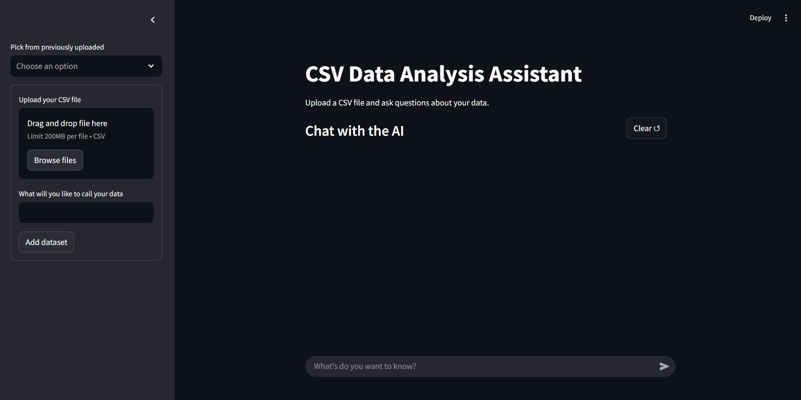
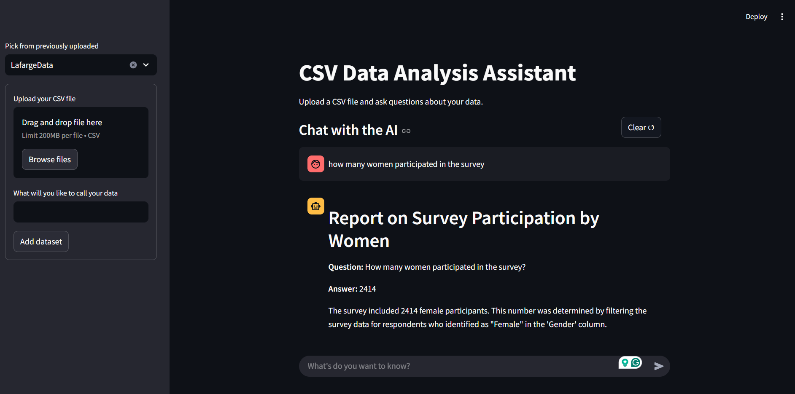

# CSV Analysis Studio

Welcome to the **CSV Analysis Studio**, a Python-based project designed to analyze CSV files using a dynamic workflow powered by state graphs and AI-driven code generation. This project leverages modern tools and libraries to automate data analysis tasks, making it easier to extract insights from CSV datasets.

---

## Features

- **Dynamic Workflow**: Uses a state graph to manage the flow of operations, from loading data to generating and executing Python code.
- **AI-Powered Code Generation**: Automatically generates Python scripts to answer user-defined questions about the dataset.
- **Error Handling and Debugging**: Regenerates and validates code in case of errors during execution.
- **Data Visualization**: Supports graph generation for workflow visualization.
- **Extensibility**: Modular design allows for easy integration of additional features.

---

## Concepts and File Overview

### 1. **State Management (`agentx.py`)**
    - Defines the `AgentState` class, a `TypedDict` that tracks the state of the workflow.
    - Stores information such as the dataset, generated code, user question, and execution results.

### 2. **File Handling (`filehandler.py`)**
    - Loads the CSV file and preprocesses it by dropping empty columns.
    - Extracts the dataset's head and column names for context.

### 3. **Query Handling (`query_handler.py`)**
    - Handles user questions and transitions the workflow to the next state.

### 4. **Code Generation and Execution (`code_handler.py`)**
    - **Code Generation**: Uses AI (via `langchain`) to generate Python scripts based on the dataset and user question.
    - **Validation**: Verifies the correctness of the generated code.
    - **Execution**: Executes the validated code and retrieves the result.
    - **Regeneration**: Debugs and regenerates code in case of errors.

### 5. **Response Generation (`response_gen.py`)**
    - This generates a report using the question and the answer calculated so that it isnt just a basic response.


### 6. **State Graph Workflow (`graphGen.py`)**
    - Defines the workflow using `StateGraph` from the `langgraph` library.
    - Manages transitions between states such as file loading, question handling, code generation, validation, execution, and result display.

### 6. **Configuration (`langgraph.json`)**
    - Specifies the environment, dependencies, and graph configurations for the project.

### 7. **Database management(`db.py`)**
    - Stores the details of the data in a local db to allow faster retrieval of the data
    -   
---

## Setup Instructions

Follow these steps to set up and run the project:

### 1. **Clone the Repository**
```bash
git clone https://github.com/oladapo-joseph/csv-analysis.git
cd csv-analysis
```

### 2. **Set Up a Virtual Environment**
```bash
python -m venv venv
source venv/bin/activate  # On Windows: venv\Scripts\activate
```

### 3. **Install Dependencies**
```bash
pip install -r requirements.txt
```

### 4. **Prepare the Environment**
 - Create a `.env` file in the root directory and add your environment variables (e.g., API keys for `langchain`, `openai`).

### 5. **Run the Workflow**
* To execute the workflow, run the `graphGen.py` file, after setting up the environment:
```bash
    cd studio
    langgraph dev     # this opens the langgraph UI for workflow visualization and simulation
```


---

## Example Usage

1. In your working directory
```
    streamlit run app.py
```



2. Upload the file
3. Ask your questions

An example below 


---
. 


---
## Dependencies

- Python 3.11
- `pandas`
- `langchain`
- `langgraph`
- `dotenv`
- `graphviz`
- `OpenAI`

---

## Future Enhancements

- Add support for more complex queries.
- Integrate additional data visualization tools.
- Expand error handling capabilities.

---

## License

This project is licensed under the [MIT License](LICENSE).

---

Happy analyzing! 🚀  